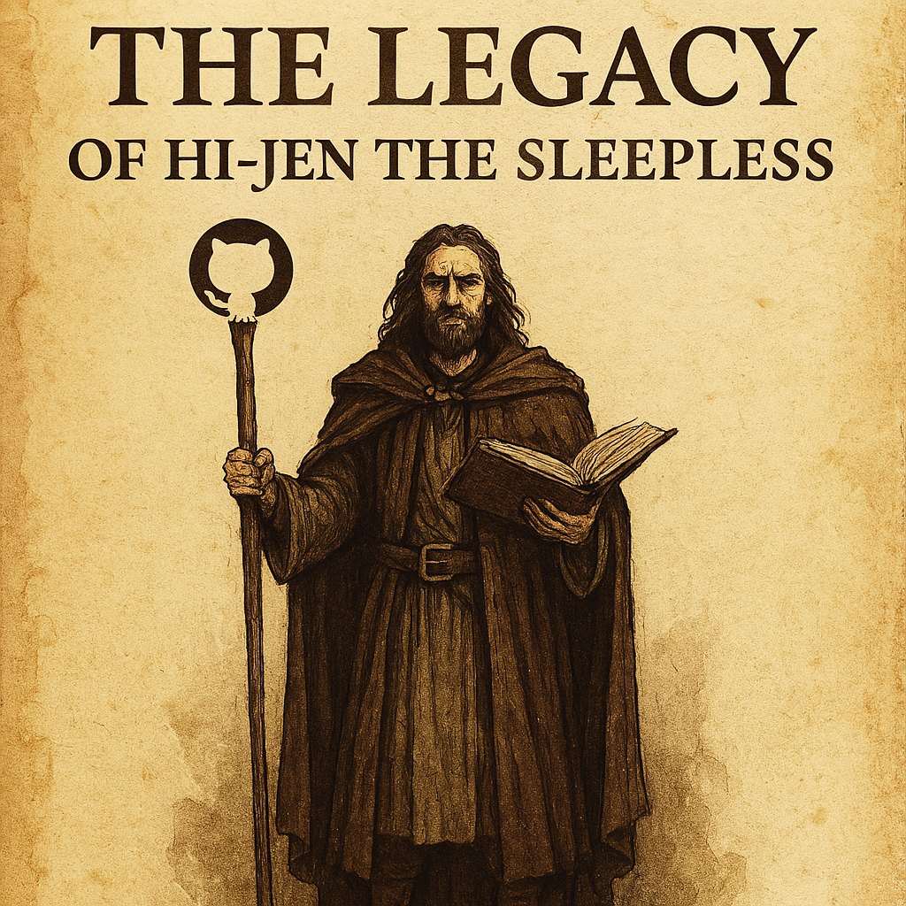

# University Study
---------------------------
- 대학 공부 및 과제 업로드
---------------------------
# 🧙‍♀️ The Legend of Hi-Jen the Sleepless

> "Code well, sleep less, leave no bug behind."

<div align="center">
  
</div>

---

## 🌍 The University Realm
Welcome to the realm where deadlines are dragons and group projects are betrayal simulators. This repository contains the legendary code fragments, forsaken folders, and immortal wisdoms of Hi-Jen — the sleepless knight of the Terminal Kingdom.

---

## 🛠️ Weapons of Hi-Jen
- 💻 **Blade of VSCode**: Syntax-enhanced, auto-complete blessed.
- ☕ **Potion of Caffeine +9**: Grants +50% focus, -30% sleep.
- 📜 **Scroll of Stack Overflow**: Powerful, but overused.

---

## 🧙‍♂️ Hi-Jen’s Legendary Party

<div align="center">
  
</div>

| Name       | Class         | Trait                                 |
|------------|---------------|----------------------------------------|
| Hi-Jen     | Night Coder   | Crits under pressure, immune to sleep |
| Copytin    | Shadow Rogue  | Disappears during team meetings       |
| Stackia    | Cleric        | Revives logic using sacred docs       |
| Caffineer  | Alchemist     | Brews sacred Espresso of Focus        |

---

## ⚔️ Bosses Faced
- 📚 **Prof. Segfaultus** — Lord of Memory Errors  
- 🕒 **Deadline Reaper** — Spawns at 11:59PM sharp  
- 👹 **Group Project Ogre** — Carries 1 weapon: "안읽씹"

---

## 📁 Sealed Folders (a.k.a. The Graveyard)

```bash
/The_Forgotten/     # 90% working, 0% readable
/DontOpen/          # Legend says no one opened it twice
/RevengeProject/    # Born from injustice, died from exams
/Attempt_001~007/   # May their bugs rest in peace
